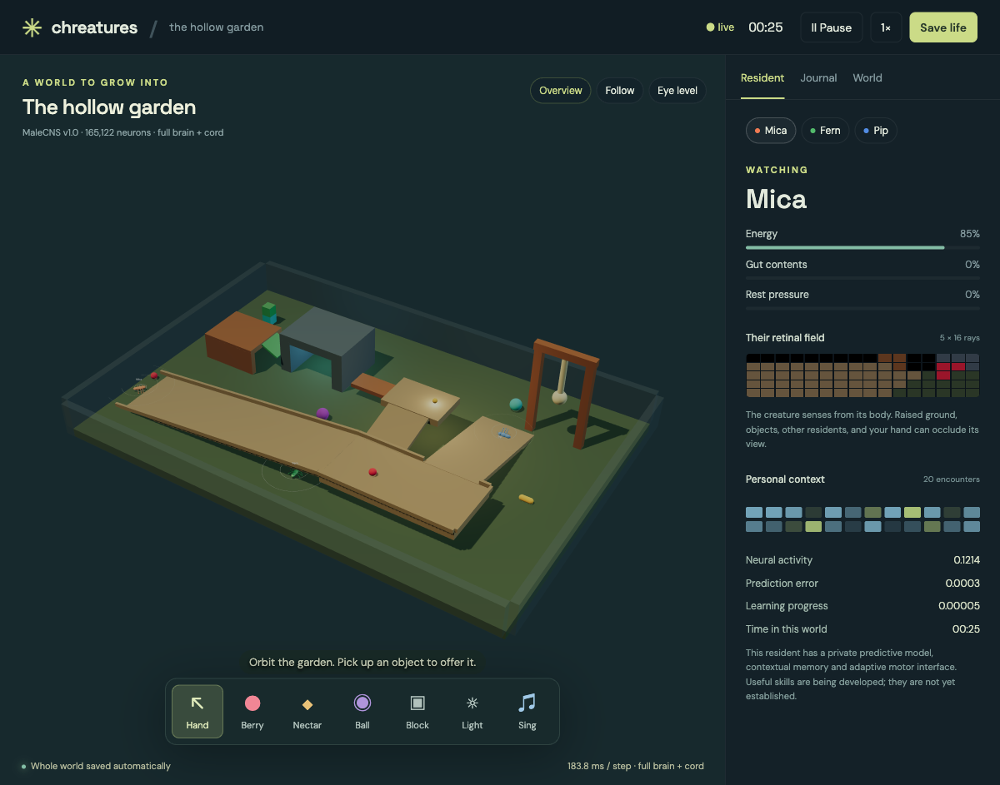
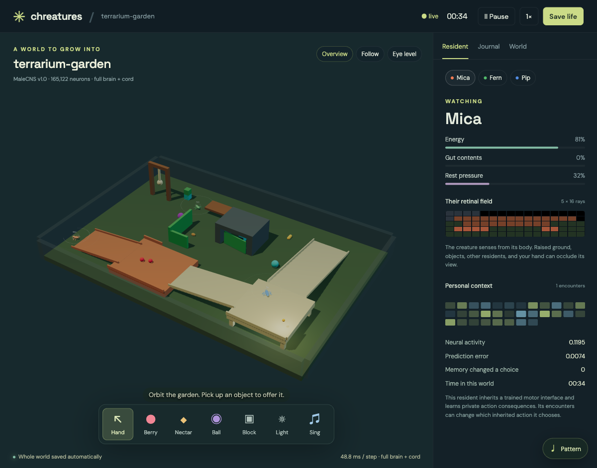

# Chreatures

**A world to grow into.** Connectome-rooted artificial life, physical bodies, personal memories, and people on the other side of the glass.

Chreatures is an ambitious work in progress inspired by *Creatures*: organisms whose surroundings, physiology, learning, and encounters have consequences for one another. We want lives that become different through experience, and instruments that let us investigate why.



*The articulated garden, running real physics, full MaleCNS neural state, and chemical transport. Six-legged bodies explore an elevated walk, sheltered passages and movable objects.*

## What exists today

The live 3D loop couples MuJoCo bodies to **165,122 traced MaleCNS neurons**, **25,563,197 directed connections**, and **124,025,046 measured synapses**. Residents keep private neural activity, adaptation and support state. Controller lineages include online adaptive organs and inherited population-trained motor policies with personal contextual memory.

The garden contains ramps, an elevated walk, an underpass, rolling and stackable objects, edible resources, a seesaw and a resonant pendulum. Objects have independently specified geometry, material and sensory properties. Residents see an occluded retinal field from their bodies, sample scent and contact, and can move, look, grip and signal. A human can physically hold and release objects, offer resources, place lights and make sounds. The browser renders the authoritative simulation state.

The newer live world runs six-legged bodies with twelve physical hinges, conservative 3D chemical transport around solid geometry, and a 351-channel sensory interface with 384 anatomical population readouts. Its retina rotates with the complete body orientation, including climbing and inversion. Batched developmental worlds run on AMD GPUs. Older saved residents retain their original bodies and interfaces; see the [cycle log](docs/CYCLE_LOG.md).

**This is a synthetic species experiment, not a recovered fly.** Anatomy is measured; rate dynamics, physiological laws, body mechanics and sensory/motor mappings contain explicit modeling assumptions. Personal learning mechanisms are running, but durable individuality, useful learned manipulation and reciprocal social skills remain research targets.

## GAM × Universal Weave

Two projects are central to where this is going:

- **[SauersML/gam](https://github.com/SauersML/gam)** — Rust-backed statistical modeling for fitted physiological response laws, nonlinear effects of state and upbringing, event histories, representation geometry and intervention analysis. The native integration now fits real 3D developmental telemetry with entire worlds held out, compares against persistence baselines, and saves/reloads immutable model artifacts. The broader mechanism and geometry work is ahead.
- **[transkatgirl/universal-weave](https://github.com/transkatgirl/universal-weave)** — branching histories and evidence records. Our Rust adapter imports real journal events and multi-parent comparisons into a native independent weave, preserving event identity and artifact ancestry through serialization. The [3D observatory](docs/OBSERVATORY.md) keeps adult snapshots, research cohorts, fits and claims distinct from residents’ own memories.

Both native libraries have been executed, not merely named in an architecture diagram. See [the integration contracts and receipts](docs/LIBRARIES.md). Their warnings and limitations are retained with their results.

## Try the compact reference

The smallest runnable version needs no GPU or model service:

```sh
git clone https://github.com/emberian/chreatures.git
cd chreatures
uv sync --extra dev
uv run chreatures
```

Open **http://127.0.0.1:8765**. Place food, toys and shelter; drag objects; use **A / S / D** to sing, **Space** to pause, and the inspection panel to see local sensory and neural state. Whole-world state saves under `runs/` and resumes on restart.

This compact **2D reference uses a female FlyWire v783 subset of 6,789 neurons**, not MaleCNS. Its attraction/avoidance and association rules are explicit bootstrap mechanisms. It remains useful for reproducible development while the larger world grows. [Data selection and provenance](docs/CONNECTOME.md).

## Run the full 3D habitat

The full graph is downloaded separately; large arrays and checkpoints do not belong in Git. The neural service can use PyTorch on AMD or the local Rust/Metal backend on Apple Silicon. The habitat/browser can run separately from it.

1. Build the required [native world kernels](native/world-kernels/README.md) with `uv run python native/world-kernels/build_extension.py`. Then follow [MaleCNS acquisition](docs/MALECNS.md) and choose the [persistent accelerator service](docs/REMOTE_BRAIN.md) or the [local Apple Metal backend](docs/METAL_BRAIN.md). Both use the [rich retinal port setup](docs/NEURAL_PORTS.md).
2. Reach that service over localhost or an SSH forward, then run:

```sh
uv run chreatures3d --port 8768 --brain-url http://127.0.0.1:18767 \
  --checkpoint runs/articulated-garden.json
```

Open **http://127.0.0.1:8768**. The example assumes the rich neural service is forwarded to local port 18767. A 3D checkpoint contains physics, personal cognitive state and the checksum of a server-side neural snapshot. Preserve both parts. Restore checks anatomy and sensory-interface identity; a failed distributed step pauses instead of blindly advancing again.

Actual circuit workloads have run on an AMD RX 6750 XT and Radeon 890M. [GPU results](docs/GPU_NURSERY.md), [developmental training](docs/DEVELOPMENT.md), [3D direction](docs/THREE_DIMENSIONS.md), [articulated body](docs/ARTICULATED.md), [chemical fields](docs/FIELDS.md), [retinal ports](docs/NEURAL_PORTS.md).

Development uses a shared predictive actor–critic with private recurrent state, articulated environments in persistent worker processes, and the full neural graph on every physical tick. The native AMD kernel improved a paired 48-resident neural benchmark by **5.84×**. The 20,000-step stage increased held-out ingestion from 0.372 to 2.859 in its evaluation, but movement cost increased and overall bodily return worsened. Removing neural features reduced ingestion to 2.173; a matched rewired graph produced more ingestion under the same policy in a larger probe. These results show sensory and topological effects, without establishing an advantage for the biological wiring. [Learning protocol](docs/LEARNING.md), [measured sparse-loop optimization](docs/FAST_CIRCUIT.md), and [physical throughput](docs/PHYSICAL_THROUGHPUT.md).

A small [trained motor artifact](data/genomes/nursery-20000.npz) is included. For a new experimental world, add:

```sh
--motor-genome data/genomes/nursery-20000.npz --personal-memory \
--habitat data/habitats/orchard-garden.json \
--resources data/ecology/portable-orchard.json \
--acoustics data/components/acoustic-play.json
```

Use a fresh checkpoint and a separate ordered neural service. The inherited motor runs on NumPy, with private working context and random state. With `--personal-memory`, a separate private action-conditioned memory records actual bodily consequences and can refine future choices. It preserves the inherited policy’s exploration. The current live orchard has sparse personal reinforcement and no demonstrated durable individual strategies yet. Its training used earlier camera and odor semantics, so this richer world is a [transfer experiment](docs/MOTOR_INHERITANCE.md). [Resource production](docs/ECOLOGY.md) and [physical sound](docs/ACOUSTICS.md) preserve finite pools and transfer histories in the whole-world checkpoint.

The newer [terrarium](docs/TERRARIUM.md) adds connected terraces, an underdeck, a return ramp, renewable movable food and five acoustic mechanisms. The [visitor panel](docs/VISITOR.md) records and schedules sound, light and physical gestures in model time, including across a checkpoint.

The latest **learning garden** adds a [passive pressure lift and coupled gate](docs/MECHANICAL_ASSEMBLIES.md), an inherited finite-energy policy, and [private lifetime motor plasticity](docs/PERSONAL_PLASTICITY.md). Reed, Tansy and Sorrel have separate motor means, state-dependent exploration, value parameters and eligibility traces. Their actual five-tick bodily consequences update their own motor tendencies; contextual and visual evidence use the same versioned physiological objective. For a new world with its own neural service:

```sh
uv run chreatures3d --port 8771 --brain-url http://127.0.0.1:18768 \
  --checkpoint runs/learning-garden.json \
  --habitat data/habitats/learning-garden.json \
  --motor-genome data/genomes/nursery-20000-finite-energy.npz \
  --personal-memory --personal-plasticity \
  --resources data/ecology/terrarium-orchard.json \
  --acoustics data/components/terrarium-play.json
```

To make moving gates also regulate chemical transport, select `data/habitats/counterweight-chemistry.json`. Its opt-in [diffusion barriers](docs/FIELDS.md) change face permeability without deleting chemical mass. A weight left on a lift can therefore alter another resident's passage and sensory environment.

The fresh finite-energy training run improved short held-out bodily return from 0.092 to 0.122; silencing neural features scored -0.961. Those probes lasted only 40 model seconds. Longer observation of the older inherited residents exposed reserve depletion and persistent fatigue. **Sustained feeding and recovery remain unmet capabilities.** New [embodied developmental worlds](docs/EMBODIED_TRAINING.md) use the actual body-frame senses, diffusion and resource ecology, with 1,200-second horizons. The optional [edge-tiled AMD backend](docs/TILED_CIRCUIT.md) cuts a complete B48 device update from 34.1 to 20.5 ms.

A separate [mushroom-body research mode](docs/MUSHROOM_PLASTICITY.md) now puts private plasticity on 4,184 measured KC→MBON11 connections inside the full neural graph. It reads actual Kenyon-cell activity and applies correctly normalized recurrent corrections. Controlled modulation changes subsequent MBON responses and persists exactly; the present responses generalize broadly across the tested cues. This mode has not been promoted into the resident worlds or assigned a behavioral reward meaning.



Optional native vision now joins the personal motor loop. A resident's actual camera captures a pair of views around one five-tick motor action. A fixed model-time delivery boundary makes those delayed features available to its private [visual episodic memory](docs/VISUAL_EPISODES.md), which can contribute bounded action evidence. More than twenty genuine pairs have been retained in the live terrarium; improved visual decisions remain unestablished. The native inference service setup is in [PERCEPTION.md](docs/PERCEPTION.md).

The original terrarium retained the legacy retinal frame because its supplied habitat lacked an explicit selector. The newer learning garden explicitly uses `body-v1`, including complete body rotation and self-occlusion. New world construction now makes that choice explicit; restoration preserves each older world's saved semantics.

For a fresh terrarium, use the terrarium habitat/resource/acoustic JSON files and add `--perception-url http://127.0.0.1:18775` when that service is available. Existing saved lives retain their own organs. Open `/observatory` for native GAM fits and the navigable Weave evidence graph; the scientific archive remains separate from personal memory.

## Building wide and deep

We are building with parallel agents and human direction. Working commits are intentionally frequent. The priorities are physical possibilities, consequential personal learning, credible biological contribution and a world worth spending time in.

The implementation direction is a Rust simulation core with batched native interfaces, with Python for training and research integration. MuJoCo supplies native physics, and the [world kernels](native/world-kernels/README.md) process contacts and conservative chemical transport. Rust also runs GAM, the Weave adapter and the [local Metal full-graph backend](docs/METAL_BRAIN.md). A complete three-resident request measured 9.55 ms with its Metal SIMD kernel on an M2 Max; the AMD development backend uses tiled full-graph kernels. Existing live processes adopt new numerical execution only at a recorded checkpoint boundary.

We retain one current implementation of each mechanism. Superseded production code belongs in Git history or a pinned release; older snapshots receive a one-way data migration where practical. Independent numerical reference equations may remain in research probes. The `pre-native-world-20260905` tag preserves the previous world engine.

A separate [trainable recurrent predictive-state organ](docs/PREDICTIVE_STATE.md) learns multi-step sensory consequences from actual action histories and exports weights for native inference. It has run on a short real rollout; long-history training and policy integration remain work in progress. An auxiliary prediction loss alone is not a planning capability.

Useful contributions include better embodied learning, controllable bodies, combinable physical environments, grounded perception, memory mechanisms and experiments that distinguish the proposed explanation from a simpler one. An LLM may become a bounded perceptual or semantic organ; it should not silently supply all behavior while the rest of the organism is decorative.

## Attribution and reuse

Original Chreatures code is licensed under **AGPL-3.0-or-later**. See [LICENSE](LICENSE)
and [NOTICE.md](NOTICE.md). Vendored code, pretrained models, scientific datasets,
and derived data retain their separately identified licenses.

- **MaleCNS v1.0:** [Janelia release](https://male-cns.janelia.org/download/), with source hashes, filtering and license attribution in [the local manifest](data/malecns/manifest.json).
- **FlyWire / published brain model:** [the source ledger](docs/CONNECTOME.md). The compact extracted data retains the conservative **CC BY-NC 4.0** public-release restriction documented there; it is not relicensed by this repository.
- **GAM:** AGPL-3.0-or-later. **Universal Weave:** Unlicense. **Three.js:** MIT, with its license beside the vendored renderer.

Keep the notices and provenance for each component with reused artifacts.
